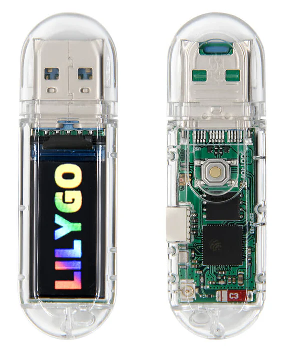

# t-dongle-s3-wifi-guard

This project turns the [LilyGO T-Dongle-S3](https://lilygo.cc/products/t-dongle-s3) into a portable passive deauthentication attack detector.



It does not transmit frames. It passively monitors 2.4 GHz Wi-Fi management traffic in promiscuous mode, looks for repeated deauthentication bursts, shows the currently targeted MAC address on the built-in display, blinks the onboard RGB LED red during an alert, and writes throttled event logs to the SD card.

## Demo


## Features

- Passive deauth detection on 2.4 GHz Wi-Fi channels 1-13
- Channel hopping every 400 ms
- Display alert showing the targeted MAC address without scrolling
- BOOT button toggles monitoring pause/resume
- Onboard LED status indication
- SD card session logging with a new file on every power cycle
- Release packaging into a single merged firmware image for GitHub distribution
- Standalone export workflow for a cleaner detector-only GitHub repo

## Hardware

- LilyGO T-Dongle-S3
- USB data cable
- Optional microSD card for event logging

## Dependencies

- Windows PowerShell 5.1 or newer
- PlatformIO Core
- ESP32 platform packages downloaded by PlatformIO
- Python runtime bundled with PlatformIO

This repository is already configured to build the detector example through [platformio.ini](platformio.ini).

## Project Layout

- Main firmware: [examples/deauth_detector/deauth_detector.ino](examples/deauth_detector/deauth_detector.ino)
- Build config: [platformio.ini](platformio.ini)
- PowerShell build script: [scripts/build_deauth_detector.ps1](scripts/build_deauth_detector.ps1)
- PowerShell release packager: [scripts/package_deauth_detector.ps1](scripts/package_deauth_detector.ps1)
- PowerShell flash script: [scripts/flash_deauth_detector.ps1](scripts/flash_deauth_detector.ps1)
- PowerShell standalone export: [scripts/export_standalone_repo.ps1](scripts/export_standalone_repo.ps1)
- Windows batch launchers: [build_deauth_detector.bat](build_deauth_detector.bat), [package_deauth_detector.bat](package_deauth_detector.bat), [flash_deauth_detector.bat](flash_deauth_detector.bat), [export_standalone_repo.bat](export_standalone_repo.bat)

## Setup

1. Install PlatformIO Core.
2. Clone this repository.
3. Connect the T-Dongle-S3 over USB.
4. Insert a microSD card if you want event logs.
5. Confirm the device COM port in Device Manager.

## Build

Run either of these from the repository root:

```powershell
.\scripts\build_deauth_detector.ps1
```

```bat
build_deauth_detector.bat
```

This compiles the firmware for the default `T-Dongle-S3` environment and produces build artifacts under `.pio/build/T-Dongle-S3/`.

## Package Release Image

Run either of these:

```powershell
.\scripts\package_deauth_detector.ps1
```

```bat
package_deauth_detector.bat
```

This does two things:

1. Builds the firmware.
2. Merges `bootloader.bin`, `partitions.bin`, and `firmware.bin` into one flashable image in `release/`.

The merged image is suitable for publishing on GitHub releases.

## Flash

Flash the newest packaged image to `COM16`:

```powershell
.\scripts\flash_deauth_detector.ps1 -Port COM16
```

```bat
flash_deauth_detector.bat -Port COM16
```

Flash a specific merged image:

```powershell
.\scripts\flash_deauth_detector.ps1 -Port COM16 -ImagePath .\release\deauth-detector-T-Dongle-S3-YYYYMMDD-HHMMSS-merged.bin
```

If no packaged image exists, the flash script falls back to a PlatformIO upload from the current build tree.

## Export Clean GitHub Folder

Run either of these:

```powershell
.\scripts\export_standalone_repo.ps1
```

```bat
export_standalone_repo.bat
```

This creates `standalone-github/` with only the detector-specific files needed for a cleaner standalone repository.

## Manual Flash Offsets

If you need to flash separate binaries manually, use these offsets:

- `0x0000` bootloader
- `0x8000` partitions
- `0x10000` application firmware

The board configuration used here is:

- Chip: `esp32s3`
- Flash size: `16MB`
- Flash mode: `dio`
- Flash frequency: `80m`
- Upload baud: `921600`
- Serial monitor baud: `115200`

## Runtime Behavior

- Startup initializes the display, LED, Wi-Fi monitor, and optional SD logging.
- The device hops across channels 1-13 while listening for repeated deauthentication frames.
- A deauth alert is only shown after repeated packets cross the configured threshold.
- During an alert, the screen shows the targeted MAC address and holds it slightly longer so it is readable.
- Pressing the BOOT button pauses or resumes monitoring.

## SD Logging

If an SD card is present, the firmware creates a new log file inside `/logs/` on every boot.

The filename includes:

- Boot uptime in milliseconds
- A random session suffix

Example:

```text
11:11:11:11:11:11 = access point
88:88:88:88:88:88 = target
```

```text
Example log file: /logs/boot_0000001234_881E9D41.log

[0000001701 ms] START session=881E9D41
[0000002702 ms] MONITOR_READY
[0000016237 ms] DEAUTH target=11:11:11:11:11:11 src=88:88:88:88:88:88 dst=11:11:11:11:11:11 ch=10 kind=1 burst=1 packet_ms=0000016237
[0000016372 ms] DEAUTH target=88:88:88:88:88:88 src=11:11:11:11:11:11 dst=88:88:88:88:88:88 ch=10 kind=2 burst=5 packet_ms=0000016371
[0000016500 ms] DEAUTH target=11:11:11:11:11:11 src=88:88:88:88:88:88 dst=11:11:11:11:11:11 ch=10 kind=1 burst=1 packet_ms=0000016496
```

The log includes:

- Startup
- Monitor ready
- Standby and resume transitions
- A throttled sample of deauth packets during an attack window

Deauth log entries include:

- Detection timestamp
- Target MAC
- Source MAC
- Destination MAC
- Channel
- Alert kind
- Burst count
- Packet timestamp in uptime milliseconds

Logging is intentionally throttled so the detector stays responsive and does not try to write every packet to the SD card.

## Notes

- Timestamps are uptime milliseconds, not wall-clock date/time.
- The detector is passive and intended for defensive monitoring and lab analysis.
- The project currently targets the `T-Dongle-S3` environment configured in [platformio.ini](platformio.ini).
